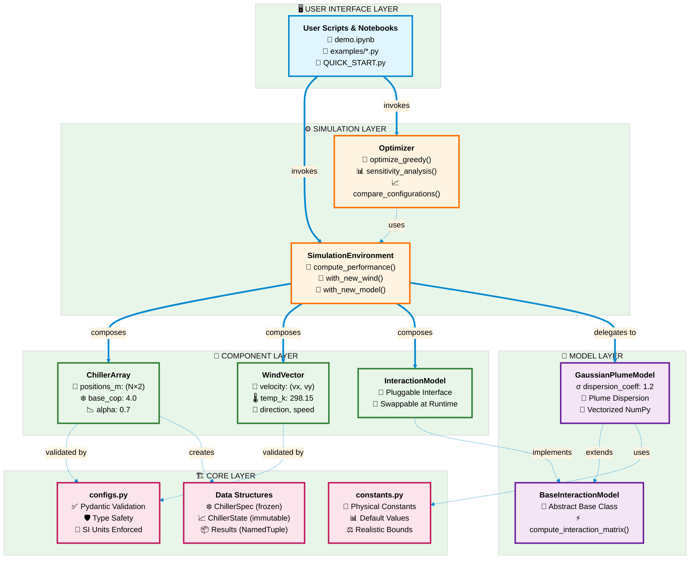
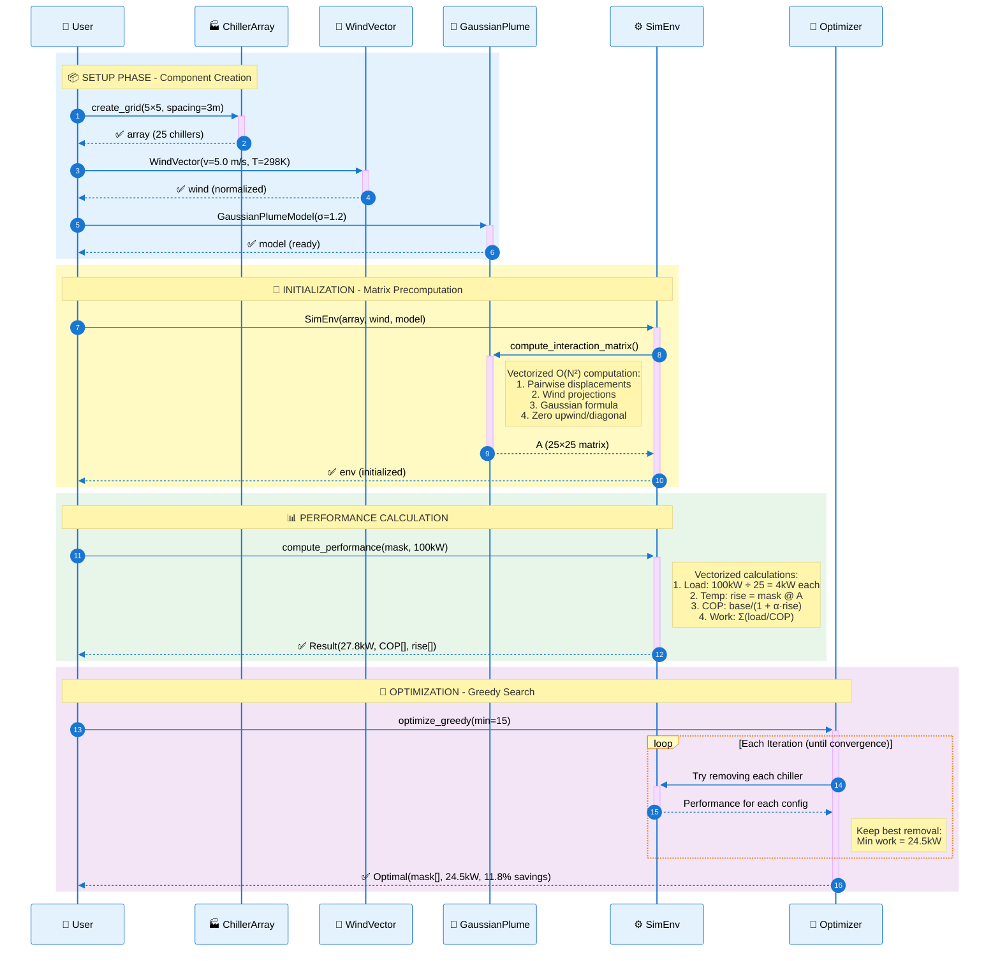
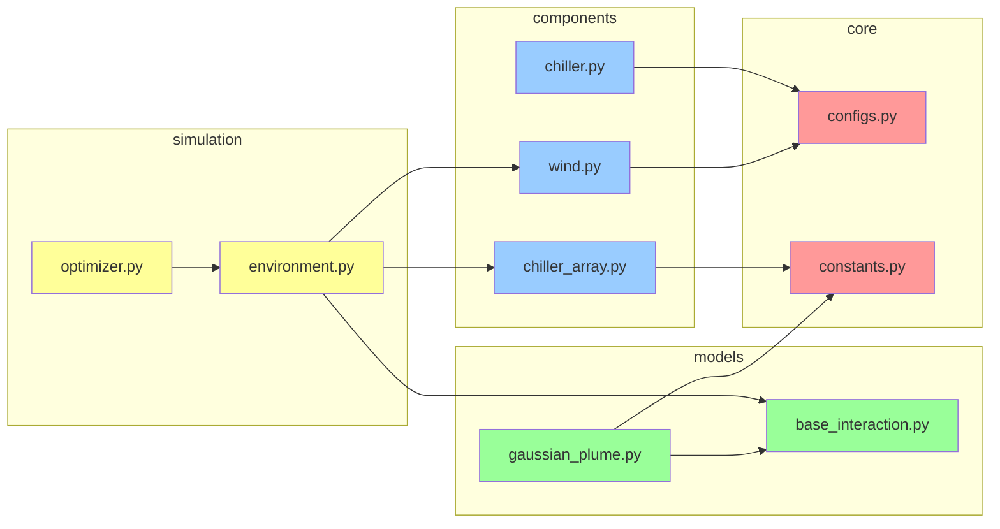
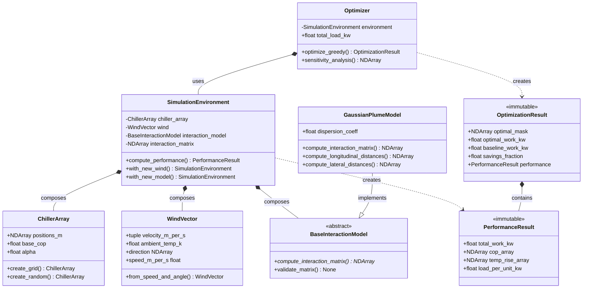

# Chiller Model Architecture Diagrams

This directory contains **professional, publication-ready** visual architecture diagrams for the chiller-model package.

> 💡 **Tip**: Click any diagram to view it larger. GitHub renders these automatically!

## System Architecture Diagram

High-level overview showing all layers and their relationships.



## Data Flow Diagram

Complete execution flow from user input to optimization results.



## Module Dependency Graph



## Physics Calculation Flow

```mermaid
flowchart TD
    START([Start: Active Mask + Load]) --> DIST[Distribute Load Evenly<br/>load_per_unit = total_load / n_active]
    DIST --> TEMP[Compute Temperature Rise<br/>temp_rise = active_mask @ A]
    TEMP --> COP[Degrade COP<br/>cop = base_cop / (1 + alpha * temp_rise)]
    COP --> WORK[Calculate Electrical Work<br/>work = sum(load / cop) for active units]
    WORK --> RESULT[Return PerformanceResult<br/>total_work_kw, cop_array, etc.]
    RESULT --> END([End])
    
    style START fill:#e1f5ff
    style DIST fill:#fff4e1
    style TEMP fill:#ffe1e1
    style COP fill:#e1ffe1
    style WORK fill:#f5e1ff
    style RESULT fill:#e1fff5
    style END fill:#e1f5ff
```

## Greedy Optimization Algorithm

```mermaid
flowchart TD
    START([Start: All Chillers Active]) --> BASELINE[Compute Baseline Performance<br/>baseline_work = performance with all active]
    BASELINE --> INIT[Initialize:<br/>best_mask = all active<br/>best_work = baseline_work]
    INIT --> CHECK{n_active ><br/>min_active?}
    CHECK -->|No| DONE[Return OptimizationResult]
    CHECK -->|Yes| LOOP[For each active chiller i]
    LOOP --> TRY[Try: mask_i = mask with chiller i OFF]
    TRY --> EVAL[Compute: work_i = performance(mask_i).work]
    EVAL --> BETTER{work_i <<br/>best_work?}
    BETTER -->|Yes| UPDATE[Update:<br/>best_removal = i<br/>best_work = work_i]
    BETTER -->|No| NEXT{More chillers<br/>to try?}
    UPDATE --> NEXT
    NEXT -->|Yes| LOOP
    NEXT -->|No| IMPROVE{Found<br/>improvement?}
    IMPROVE -->|Yes| APPLY[Apply best removal:<br/>mask[best_removal] = False<br/>iterations += 1]
    IMPROVE -->|No| DONE
    APPLY --> CHECK
    DONE --> END([End: Optimal Configuration])
    
    style START fill:#e1f5ff
    style BASELINE fill:#fff4e1
    style INIT fill:#fff4e1
    style CHECK fill:#ffe1e1
    style LOOP fill:#e1ffe1
    style TRY fill:#f5e1ff
    style EVAL fill:#f5e1ff
    style BETTER fill:#ffe1e1
    style UPDATE fill:#e1fff5
    style NEXT fill:#ffe1e1
    style IMPROVE fill:#ffe1e1
    style APPLY fill:#e1fff5
    style DONE fill:#e1f5ff
    style END fill:#e1f5ff
```

## Class Relationships (Composition Pattern)



## Usage Instructions

### For Sphinx Documentation

Add to your `conf.py`:

```python
extensions = [
    'sphinx.ext.autodoc',
    'sphinx.ext.napoleon',
    'sphinxcontrib.mermaid',  # pip install sphinxcontrib-mermaid
]
```

Include in your `.rst` files:

```rst
.. mermaid:: diagrams.md
   :caption: System Architecture
```

### For GitHub/Markdown Viewers

GitHub natively renders Mermaid diagrams in markdown files. Just include the fenced code blocks with `mermaid` language tag.

### For Interactive Viewing

Use [Mermaid Live Editor](https://mermaid.live/) to:
1. Copy any diagram code above
2. Paste into the editor
3. View, edit, and export as SVG/PNG

### For LaTeX/Academic Papers

Export diagrams as SVG from Mermaid Live Editor, then convert to PDF:

```bash
inkscape diagram.svg --export-pdf=diagram.pdf
```

Include in LaTeX:
```latex
\includegraphics[width=\textwidth]{diagram.pdf}
```

## Diagram Maintenance

When adding new modules or changing architecture:

1. Update the relevant diagram(s) in this file
2. Regenerate documentation: `cd docs && make html`
3. Verify diagrams render correctly
4. Commit both source and generated docs

## Design Principles Illustrated

These diagrams emphasize:

- **Composition over Inheritance**: Classes hold instances, not inherit
- **Immutability**: Results are NamedTuples/frozen dataclasses
- **Separation of Concerns**: Clear layer boundaries
- **Dependency Inversion**: High-level modules depend on abstractions
- **Single Responsibility**: Each module has one clear purpose
