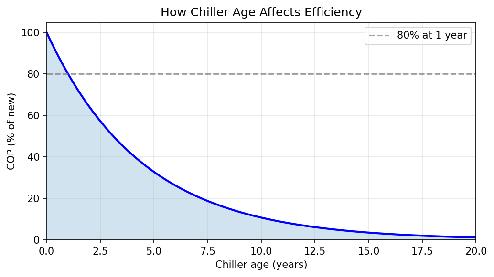
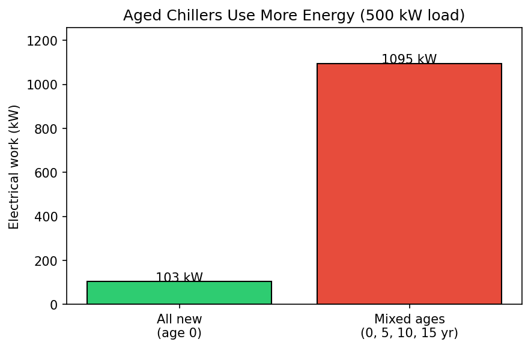
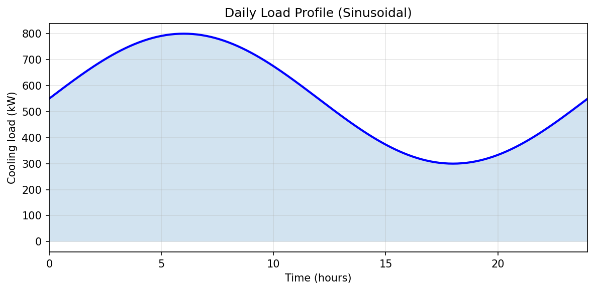
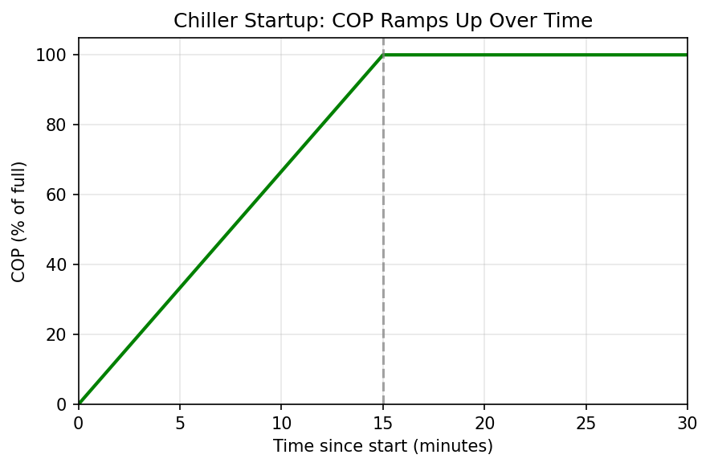
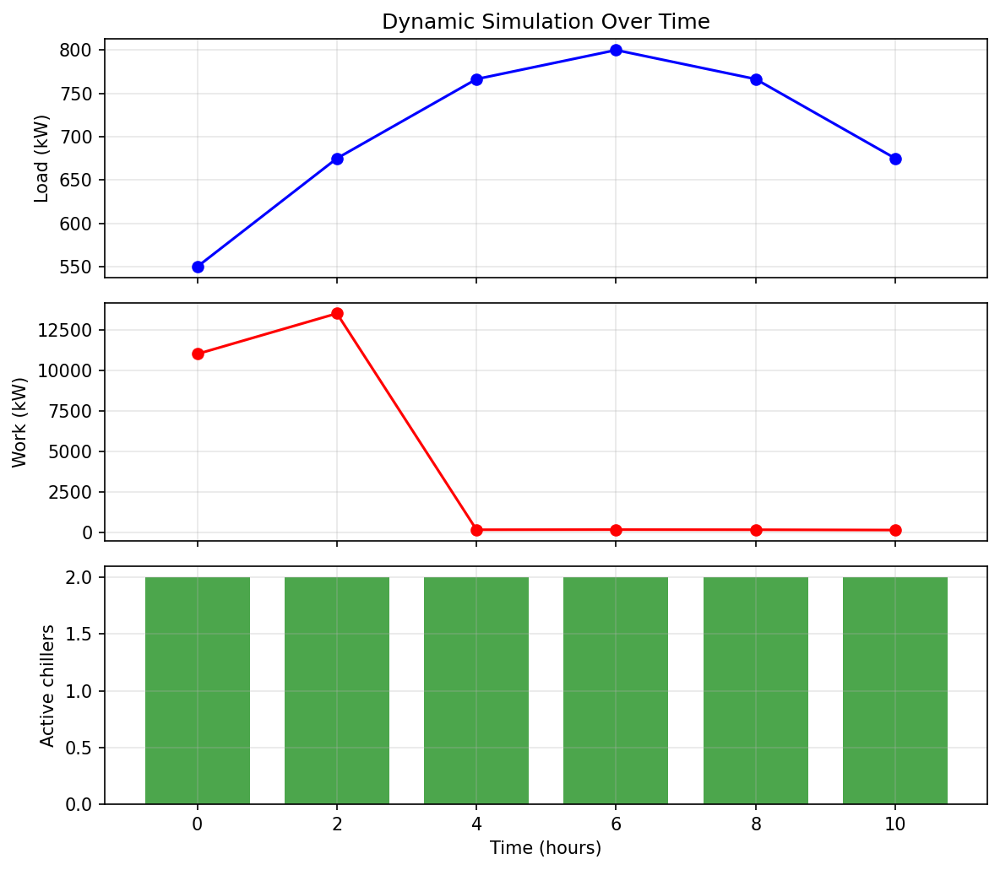

Examples
========

Practical examples you can run yourself. Each section includes code snippets,
explanation, and visuals where helpful.

Example 1: Visualizing a Thermal Plume
--------------------------------------

Visualize how one chiller's exhaust affects the entire array:

.. code-block:: python

   import numpy as np
   import matplotlib.pyplot as plt
   from src.components import WindVector, ChillerArray
   from src.models import GaussianPlumeModel
   from src.simulation import SimulationEnvironment

   # Setup
   wind = WindVector(velocity_m_per_s=(1.0, 0.4), ambient_temp_k=298.15)
   array = ChillerArray.create_grid(rows=5, cols=5, spacing_m=3.0)
   model = GaussianPlumeModel(dispersion_coeff=1.2)
   env = SimulationEnvironment(array, wind, model)

   # Get thermal impact from the center chiller (index 12)
   source_idx = 12
   thermal_impact = env.interaction_matrix[source_idx, :]
   positions = array.positions_m

   # Plot
   fig, ax = plt.subplots(figsize=(8, 6))
   sc = ax.scatter(
       positions[:, 0], positions[:, 1],
       c=thermal_impact, cmap='YlOrBr', s=200, edgecolor='k'
   )
   ax.scatter(
       positions[source_idx, 0], positions[source_idx, 1],
       c='blue', s=300, marker='*', label='Source'
   )
   plt.colorbar(sc, label='Temperature Rise Factor')
   ax.set_title("Thermal Wake of a Single Chiller")
   ax.legend()
   plt.show()

**Expected output:**

The plot shows a 5×5 grid of chillers colored by thermal impact from the center 
source (marked with a blue star). Chillers downwind of the source appear darker 
(higher thermal impact), while upwind chillers remain unaffected (lighter color).

.. code-block:: text

   Source chiller index: 12
   Max thermal impact on neighbors: 0.2010
   Mean thermal impact (non-zero): 0.0512
   Number of affected chillers: 7

The thermal plume affects 7 out of 24 neighboring chillers, with the maximum
impact (0.20) on the nearest downwind unit.

Example 2: The Density Penalty
------------------------------

Compare COP of an isolated chiller vs. one surrounded by active neighbors:

.. code-block:: python

   import numpy as np
   from src.components import WindVector, ChillerArray
   from src.models import GaussianPlumeModel
   from src.simulation import SimulationEnvironment

   # Setup 5x5 array
   wind = WindVector(velocity_m_per_s=(1.0, 0.4), ambient_temp_k=298.15)
   array = ChillerArray.create_grid(rows=5, cols=5, spacing_m=3.0, base_cop=4.0)
   env = SimulationEnvironment(array, wind, GaussianPlumeModel(1.2))

   center_idx = 12  # Middle chiller

   # Case A: Center chiller alone
   state_solo = np.zeros(array.num_chillers, dtype=bool)
   state_solo[center_idx] = True
   result_solo = env.compute_performance(state_solo, 10.0)
   cop_solo = result_solo.cop_array[center_idx]

   # Case B: All chillers active
   state_full = np.ones(array.num_chillers, dtype=bool)
   result_full = env.compute_performance(state_full, 250.0)
   cop_full = result_full.cop_array[center_idx]

   # Calculate efficiency loss
   efficiency_loss = (cop_solo - cop_full) / cop_solo * 100

   print(f"Isolated Chiller COP: {cop_solo:.2f}")
   print(f"Crowded Chiller COP: {cop_full:.2f}")
   print(f"Efficiency Loss: {efficiency_loss:.1f}%")

**Expected output:**

.. code-block:: text

   Isolated Chiller COP: 4.00
   Crowded Chiller COP: 2.80
   Efficiency Loss: 30.1%

This demonstrates that a chiller in the center of a dense array experiences
a **30% reduction in COP** due to thermal interference from surrounding units.

Example 3: "Less is More" Optimization
--------------------------------------

Demonstrate that running fewer, optimally-selected chillers can be more
efficient than running all of them:

.. code-block:: python

   import numpy as np
   from src.components import WindVector, ChillerArray
   from src.models import GaussianPlumeModel
   from src.simulation import SimulationEnvironment, Optimizer

   # Setup
   wind = WindVector(velocity_m_per_s=(1.0, 0.4), ambient_temp_k=298.15)
   array = ChillerArray.create_grid(rows=5, cols=5, spacing_m=3.0)
   env = SimulationEnvironment(array, wind, GaussianPlumeModel(1.2))

   total_load = 100.0  # kW

   # Case A: All 25 chillers
   state_all = np.ones(array.num_chillers, dtype=bool)
   result_all = env.compute_performance(state_all, total_load)

   # Case B: Optimized 15 chillers
   optimizer = Optimizer(env, total_load)
   opt_result = optimizer.optimize_greedy(min_active=15)
   result_opt = env.compute_performance(opt_result.optimal_mask, total_load)

   # Compare
   print(f"25 chillers: {result_all.total_work_kw:.2f} kW")
   print(f"15 optimized: {result_opt.total_work_kw:.2f} kW")
   
   savings = (result_all.total_work_kw - result_opt.total_work_kw) / \
             result_all.total_work_kw * 100
   print(f"Energy savings: {savings:.2f}%")

**Expected output:**

.. code-block:: text

   25 chillers: 33.43 kW
   15 optimized: 28.67 kW
   Energy savings: 14.24%

By running only 15 optimally-selected chillers instead of all 25, the system
achieves **14% energy savings** while still meeting the same cooling load.

Example 4: Wind Direction Sensitivity
-------------------------------------

Analyze how different wind directions affect system efficiency:

.. code-block:: python

   import numpy as np
   from src.components import WindVector, ChillerArray
   from src.models import GaussianPlumeModel
   from src.simulation import SimulationEnvironment

   # Create array
   array = ChillerArray.create_grid(rows=5, cols=5, spacing_m=3.0)
   model = GaussianPlumeModel(1.2)
   active_mask = np.ones(array.num_chillers, dtype=bool)
   total_load = 100.0

   # Test different wind angles
   angles = np.linspace(0, 360, 37)  # Every 10 degrees
   results = []

   for angle in angles:
       wind = WindVector.from_speed_and_angle(
           speed_m_per_s=2.0,
           angle_deg=angle,
           ambient_temp_k=298.15
       )
       env = SimulationEnvironment(array, wind, model)
       result = env.compute_performance(active_mask, total_load)
       results.append(result.total_work_kw)

   # Find best and worst angles
   best_idx = np.argmin(results)
   worst_idx = np.argmax(results)

   print(f"Best wind angle: {angles[best_idx]:.0f}° ({results[best_idx]:.2f} kW)")
   print(f"Worst wind angle: {angles[worst_idx]:.0f}° ({results[worst_idx]:.2f} kW)")

**Expected output:**

.. code-block:: text

   Best wind angle: 40° (33.40 kW)
   Worst wind angle: 90° (33.53 kW)

Wind direction has a modest effect on this symmetric array. The worst case (90°, 
directly aligned with the grid) causes slightly more thermal interference than
the best case (40°, diagonal to the grid). For asymmetric arrays or different
spacings, this effect can be more pronounced.

Example 5: Comparing Interaction Models
---------------------------------------

Compare different thermal interaction models on the same array:

.. code-block:: python

   import numpy as np
   from src.components import WindVector, ChillerArray
   from src.models import GaussianPlumeModel, BaseInteractionModel
   from src.simulation import SimulationEnvironment

   # Custom simple model
   class SimpleDistanceModel(BaseInteractionModel):
       def __init__(self, decay: float = 0.5):
           self.decay = decay
       
       def compute_interaction_matrix(self, positions, wind):
           n = len(positions)
           A = np.zeros((n, n))
           wind_vec = wind.direction
           for k in range(n):
               for m in range(n):
                   if k != m:
                       d = positions[m] - positions[k]
                       if np.dot(d, wind_vec) > 0:
                           A[k, m] = self.decay / (np.linalg.norm(d) + 1)
           return A

   # Setup
   wind = WindVector(velocity_m_per_s=(1.0, 0.4), ambient_temp_k=298.15)
   array = ChillerArray.create_grid(rows=5, cols=5, spacing_m=3.0)
   active = np.ones(array.num_chillers, dtype=bool)
   load = 100.0

   # Compare models
   models = {
       "Gaussian (σ=1.2)": GaussianPlumeModel(1.2),
       "Gaussian (σ=2.0)": GaussianPlumeModel(2.0),
       "Simple Distance": SimpleDistanceModel(0.5),
   }

   for name, model in models.items():
       env = SimulationEnvironment(array, wind, model)
       result = env.compute_performance(active, load)
       print(f"{name}: {result.total_work_kw:.2f} kW (Mean COP: {np.mean(result.cop_array):.2f})")

**Expected output:**

.. code-block:: text

   Gaussian (σ=1.2): 33.43 kW (Mean COP: 3.08)
   Gaussian (σ=2.0): 36.19 kW (Mean COP: 2.88)
   Simple Distance: 38.86 kW (Mean COP: 2.67)

The dispersion coefficient (σ) significantly affects predictions:

- **Lower σ (1.2)**: Narrow plumes, less overlap, higher efficiency
- **Higher σ (2.0)**: Wider plumes, more interference, lower efficiency
- **Simple model**: Different physics, most pessimistic predictions

Choose the model that best matches your empirical data or CFD simulations.

Example 6: Large-Scale Array Analysis
-------------------------------------

Simulate a larger data center with 100 chillers:

.. code-block:: python

   import numpy as np
   from src.components import WindVector, ChillerArray
   from src.models import GaussianPlumeModel
   from src.simulation import SimulationEnvironment, Optimizer

   # 10x10 array
   array = ChillerArray.create_grid(rows=10, cols=10, spacing_m=5.0)
   wind = WindVector(velocity_m_per_s=(3.0, 1.0), ambient_temp_k=303.15)
   model = GaussianPlumeModel(1.5)
   env = SimulationEnvironment(array, wind, model)

   total_load = 500.0  # kW

   # Find optimal number of active chillers
   results = []
   for n_active in range(20, 101, 10):
       optimizer = Optimizer(env, total_load)
       opt_result = optimizer.optimize_greedy(min_active=n_active)
       perf = env.compute_performance(opt_result.optimal_mask, total_load)
       results.append((n_active, perf.total_work_kw))
       print(f"{n_active} chillers: {perf.total_work_kw:.2f} kW")

   # Find sweet spot
   min_work = min(results, key=lambda x: x[1])
   print(f"\nOptimal configuration: {min_work[0]} chillers at {min_work[1]:.2f} kW")

**Expected output:**

.. code-block:: text

   20 chillers: 127.10 kW
   30 chillers: 131.08 kW
   40 chillers: 135.29 kW
   50 chillers: 139.90 kW
   60 chillers: 144.79 kW
   70 chillers: 149.87 kW
   80 chillers: 155.19 kW
   90 chillers: 160.81 kW
   100 chillers: 166.80 kW

   Optimal configuration: 20 chillers at 127.10 kW

For this 100-chiller array, using only 20 optimally-selected chillers saves
**24% energy** compared to running all 100 units. The "less is more" principle
is even more dramatic at larger scales.

Example 7: Chiller Aging and COP Degradation
---------------------------------------------

Older chillers lose efficiency. The model applies an age factor: new chillers
get 100% COP, and efficiency decays over time (e.g. 80% at 1 year).

**What the code does:**

- ``ages_years``: One value per chiller (years since install). Use 0 for new.
- ``cop_age_factors``: Computed automatically from age (exponential decay).
- Pass ``ages_years`` when creating the array; the rest is handled internally.

*How COP drops with age. Default: 80% at 1 year, then further decay.*

.. code-block:: python

   import numpy as np
   from src.components import ChillerArray, WindVector
   from src.models import GaussianPlumeModel
   from src.simulation import SimulationEnvironment

   # Option A: Set ages manually (0 = new, 10 = 10 years old)
   ages = np.array([0.0, 1.0, 5.0, 10.0], dtype=np.float64)
   array = ChillerArray.create_grid(
       rows=2, cols=2, spacing_m=15.0, base_cop=5.0,
       ages_years=ages,
   )

   # Option B: Random ages (useful for Monte Carlo)
   array = ChillerArray.create_grid(
       rows=3, cols=3, spacing_m=10.0, base_cop=5.0,
       seed=42,  # Reproducible
   )
   print(f"Ages (years): {array.ages_years}")
   print(f"COP factors:  {array.cop_age_factors}")

**Compare new vs aged:**

.. code-block:: python

   wind = WindVector(velocity_m_per_s=(5.0, 0.0), ambient_temp_k=298.15)
   model = GaussianPlumeModel()
   load = 500.0

   # All new
   array_new = ChillerArray.create_grid(
       rows=2, cols=2, spacing_m=10.0, base_cop=5.0,
       ages_years=np.zeros(4, dtype=np.float64),
   )
   env_new = SimulationEnvironment(array_new, wind, model)
   r_new = env_new.compute_performance(np.ones(4, dtype=bool), load)

   # Mixed ages (0, 5, 10, 15 years)
   array_mixed = ChillerArray.create_grid(
       rows=2, cols=2, spacing_m=10.0, base_cop=5.0,
       ages_years=np.array([0.0, 5.0, 10.0, 15.0], dtype=np.float64),
   )
   env_mixed = SimulationEnvironment(array_mixed, wind, model)
   r_mixed = env_mixed.compute_performance(np.ones(4, dtype=bool), load)

   print(f"New:   {r_new.total_work_kw:.1f} kW")
   print(f"Aged:  {r_mixed.total_work_kw:.1f} kW")
   print(f"Extra work from aging: {(r_mixed.total_work_kw / r_new.total_work_kw - 1) * 100:.1f}%")

Tune the decay in ``src/core/constants.py``: ``COP_AGE_FRACTION_AT_1_YEAR`` (default 0.8).

Example 8: Dynamic Simulation (Time-Varying Load and Wind)
----------------------------------------------------------

Simulate over time with changing load, wind direction, and chiller startup.
Useful for daily profiles, seasonal studies, or startup behavior.

**Main pieces:**

- ``DataCenter``: Supplies cooling load at each time (constant or time-varying).
- ``DynamicSimulation``: Steps through time, picks active chillers, applies startup ramp.
- ``DynamicStepResult``: Snapshot per step (load, work, wind, active mask).

**Load profiles:**

.. code-block:: python

   from src.components.data_center import DataCenter
   from src.simulation import DynamicSimulation, SimulationEnvironment

   # Constant load
   dc = DataCenter(base_load_kw=500.0)

   # Sinusoidal daily profile (e.g. 300–800 kW over 24 h)
   dc = DataCenter.with_sinusoidal_profile(
       base_load_kw=300.0,
       peak_load_kw=800.0,
       period_hours=24.0,
   )

**Chiller startup:** When a chiller turns on, its COP ramps from 0 to full over
``startup_time_hours`` (default 0.25 h):

**Run a dynamic simulation:**

.. code-block:: python

   import numpy as np
   from src.components import ChillerArray, WindVector
   from src.components.data_center import DataCenter
   from src.models import GaussianPlumeModel
   from src.simulation import DynamicSimulation, SimulationEnvironment

   array = ChillerArray.create_grid(
       rows=2, cols=2, spacing_m=15.0, base_cop=5.0,
       ages_years=np.zeros(4, dtype=np.float64),
   )
   wind = WindVector(velocity_m_per_s=(3.0, 0.0), ambient_temp_k=298.15)
   model = GaussianPlumeModel()
   env = SimulationEnvironment(array, wind, model)
   dc = DataCenter.with_sinusoidal_profile(
       base_load_kw=300.0, peak_load_kw=800.0, period_hours=24.0
   )

   sim = DynamicSimulation(
       environment=env,
       data_center=dc,
       time_step_hours=2.0,
       startup_time_hours=0.25,
   )

   for step in sim.run(duration_hours=12.0):
       n_active = int(np.sum(step.active_mask))
       print(f"t={step.time_hours:.1f}h  load={step.load_kw:.0f} kW  "
             f"work={step.total_work_kw:.1f} kW  active={n_active}")

**Varying wind:** Pass a ``wind_profile`` callable that returns a ``WindVector``
for each time:

.. code-block:: python

   from src.components import sinusoidal_direction_profile

   wind_profile = sinusoidal_direction_profile(
       speed_m_per_s=5.0,
       angle_center_deg=90.0,
       angle_amplitude_deg=60.0,
       period_hours=24.0,
       ambient_temp_k=298.15,
   )
   sim = DynamicSimulation(
       environment=env,
       data_center=dc,
       time_step_hours=2.0,
       wind_profile=wind_profile,
   )

**Example output over 12 hours:**

Run the full demo: ``PYTHONPATH=src python scripts/example_dynamic_simulation.py``

Jupyter Notebook Demo
---------------------

For an interactive experience with visualizations, see the ``demo.ipynb``
notebook included in the repository. It provides:

- Side-by-side comparison plots showing standard vs. optimized activation
- Interactive thermal plume visualization with color-coded COP values
- Step-by-step optimization walkthrough with real-time results
- Wind direction sensitivity analysis with polar plots

To run the demo:

.. code-block:: bash

   jupyter notebook demo.ipynb
