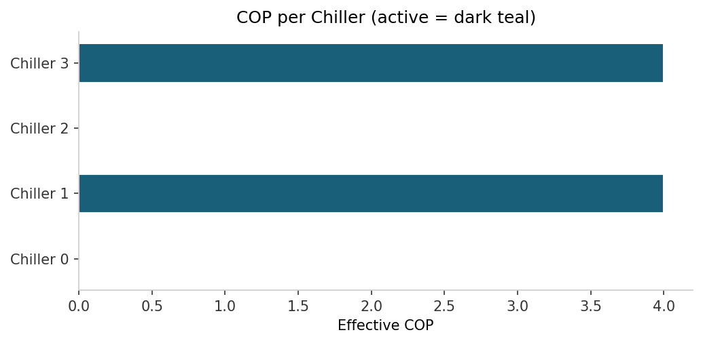
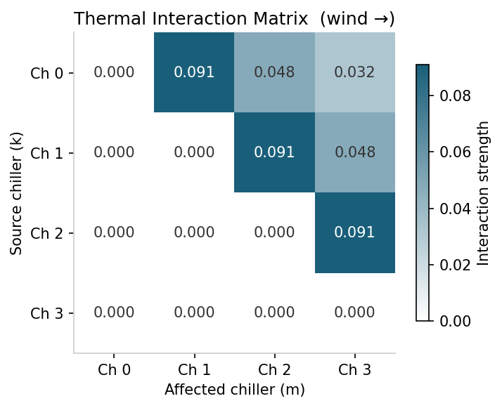
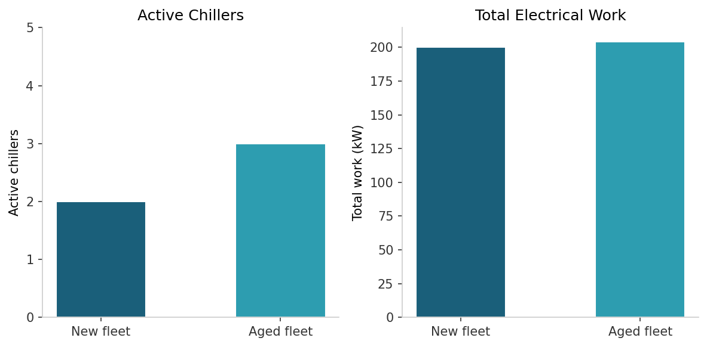
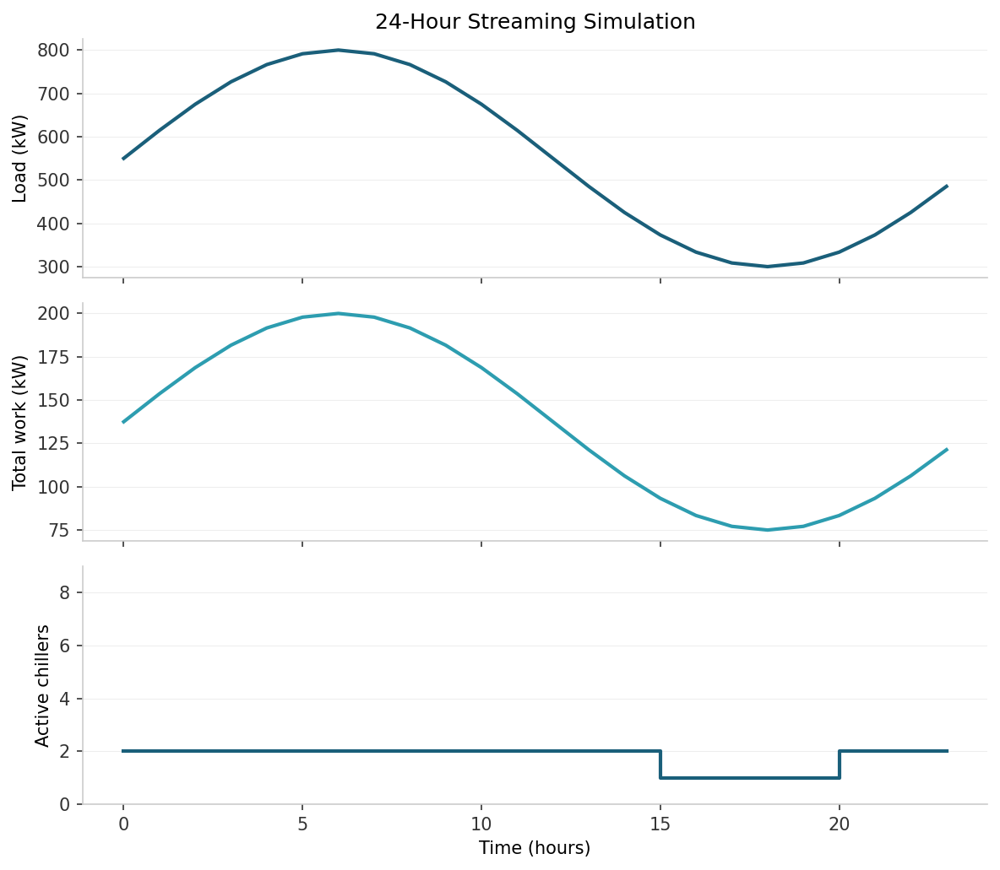
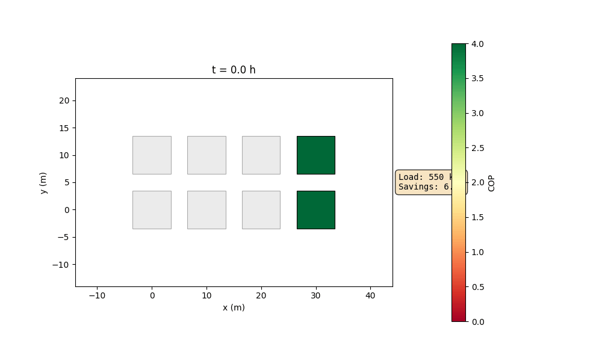
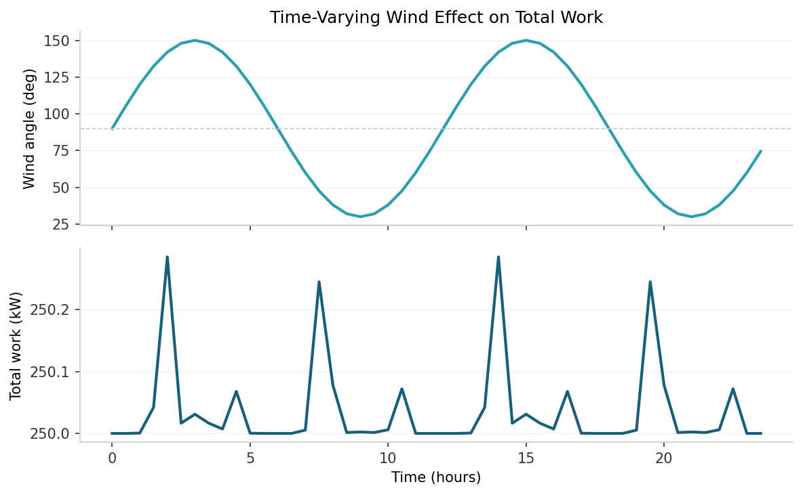
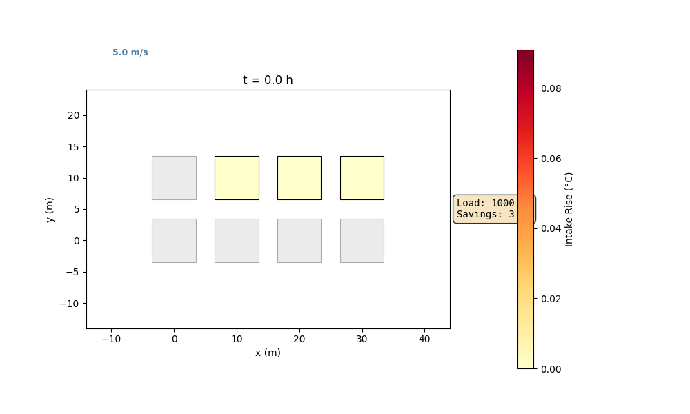

Examples
========

Five worked examples in order of increasing complexity. Each includes a
code block, expected output, and a generated image.

Example 1 -- Your First Optimization
-------------------------------------

Build a 2x2 grid, optimize at a single time step, and inspect the result.

.. code-block:: python

   import numpy as np
   from chiller_sim import Simulator

   sim = (
       Simulator()
       .with_grid(rows=2, cols=2, spacing_m=10.0, base_cop=4.0, max_cooling_kw=500.0)
       .with_wind(speed_m_per_s=5.0, angle_deg=0.0)
       .with_ambient_temp(temp_k=298.15)
       .with_load_fn(lambda t: 800.0)
       .build()
   )

   result = sim.optimize(time_hours=0.0)

   print(f"Active mask:     {result.active_mask}")
   print(f"COP per chiller: {np.round(result.cop_array, 2)}")
   print(f"Total work:      {result.total_work_kw:.2f} kW")

Horizontal bar chart of COP for each chiller -- active bars in dark teal,
inactive bars in light grey.

Example 2 -- Thermal Interference
----------------------------------

A 1x4 row of chillers with wind blowing along the row. Downwind chillers
run hotter because they sit in the exhaust plume of upwind neighbours.

.. code-block:: python

   import numpy as np
   from chiller_sim import Simulator

   sim = (
       Simulator()
       .with_grid(rows=1, cols=4, spacing_m=10.0, base_cop=4.0, max_cooling_kw=500.0)
       .with_wind(speed_m_per_s=5.0, angle_deg=0.0)
       .with_ambient_temp(temp_k=298.15)
       .with_load_fn(lambda t: 1000.0)
       .build()
   )

   result = sim.optimize(time_hours=0.0)

   print("Inlet temperature rise at each position:")
   for i, rise in enumerate(result.temp_rise_array):
       print(f"  Chiller {i}: {rise:.3f} K")

Heatmap of the 4x4 interaction matrix -- dark teal for high interaction,
white for zero.

Example 3 -- Capacity, Aging, and the Feasibility Gate
-------------------------------------------------------

Two simulations at the same load: a brand-new fleet vs. an aged fleet.
Aged chillers have lower effective capacity, so more must activate to meet
the load.

.. code-block:: python

   import numpy as np
   from chiller_sim import Simulator

   load_kw = 800.0

   # New fleet
   sim_new = (
       Simulator()
       .with_grid(rows=2, cols=2, spacing_m=10.0, base_cop=4.0,
                  max_cooling_kw=500.0, ages_years=np.zeros(4))
       .with_wind(speed_m_per_s=5.0, angle_deg=0.0)
       .with_ambient_temp(temp_k=298.15)
       .with_load_fn(lambda t: load_kw)
       .build()
   )

   # Aged fleet (20 years old)
   sim_aged = (
       Simulator()
       .with_grid(rows=2, cols=2, spacing_m=10.0, base_cop=4.0,
                  max_cooling_kw=500.0, ages_years=np.full(4, 20.0))
       .with_wind(speed_m_per_s=5.0, angle_deg=0.0)
       .with_ambient_temp(temp_k=298.15)
       .with_load_fn(lambda t: load_kw)
       .build()
   )

   r_new = sim_new.optimize(time_hours=0.0)
   r_aged = sim_aged.optimize(time_hours=0.0)

   print(f"New fleet:  {r_new.active_mask.sum()} active, {r_new.total_work_kw:.1f} kW")
   print(f"Aged fleet: {r_aged.active_mask.sum()} active, {r_aged.total_work_kw:.1f} kW")

Grouped bar chart -- two groups (new / aged), bars showing number of active
chillers and total work side by side.

Example 4 -- Streaming a 24-Hour Load Profile
----------------------------------------------

Sinusoidal load function (300--800 kW, 24 h period) fed to ``stream()``
with a 1 h time step.

.. code-block:: python

   import math
   from chiller_sim import Simulator

   sim = (
       Simulator()
       .with_grid(rows=2, cols=4, spacing_m=10.0, base_cop=4.0, max_cooling_kw=500.0)
       .with_wind(speed_m_per_s=5.0, angle_deg=0.0)
       .with_ambient_temp(temp_k=298.15)
       .with_load_fn(lambda t: 550.0 + 250.0 * math.sin(2 * math.pi * t / 24))
       .build()
   )

   for result in sim.stream(duration_hours=24.0, time_step_hours=1.0):
       n = result.active_mask.sum()
       print(f"t={result.time_hours:5.1f}h  load={result.load_kw:7.1f} kW"
             f"  work={result.total_work_kw:7.1f} kW  active={n}")

Three-panel line plot sharing the x-axis (time): top = load kW, middle =
total work kW, bottom = active chiller count.

Animated chiller grid coloured by COP. Active chillers are coloured on the
green–yellow–red scale; inactive chillers are greyed out. The load overlay
and savings fraction update each hour as the sinusoidal demand rises and falls.

Example 5 -- Time-Varying Wind
-------------------------------

Custom ``wind_fn`` that rotates wind direction sinusoidally (+-60 deg
around 90 deg, 12 h period). Shows total work varying as wind alignment
changes.

.. code-block:: python

   import math
   from chiller_sim import Simulator

   def rotating_wind(time_hours: float) -> tuple[float, float]:
       angle = 90.0 + 60.0 * math.sin(2 * math.pi * time_hours / 12)
       return (5.0, angle)

   sim = (
       Simulator()
       .with_grid(rows=2, cols=4, spacing_m=10.0, base_cop=4.0, max_cooling_kw=500.0)
       .with_wind_fn(rotating_wind)
       .with_ambient_temp(temp_k=298.15)
       .with_load_fn(lambda t: 1000.0)
       .build()
   )

   for result in sim.stream(duration_hours=24.0, time_step_hours=1.0):
       angle = 90.0 + 60.0 * math.sin(2 * math.pi * result.time_hours / 12)
       print(f"t={result.time_hours:5.1f}h  angle={angle:6.1f} deg"
             f"  work={result.total_work_kw:7.1f} kW")

Two-panel line plot -- top = wind angle over time, bottom = total work kW
over time.

Animated chiller grid coloured by intake temperature rise. The wind vane
rotates as the wind direction sweeps +-60 deg around 90 deg, visually
showing how chiller-to-chiller thermal interference shifts with wind alignment.
